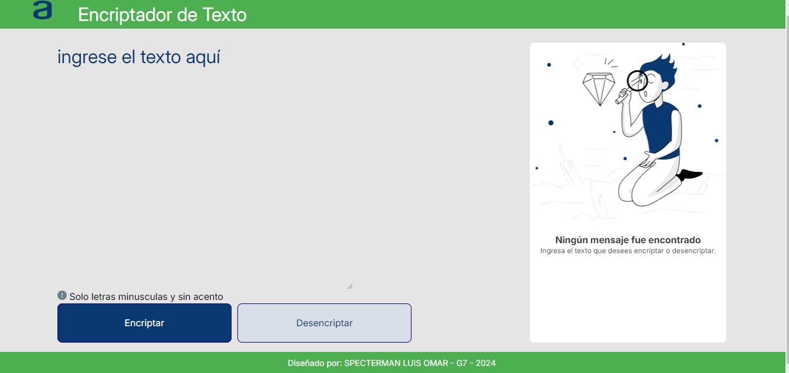
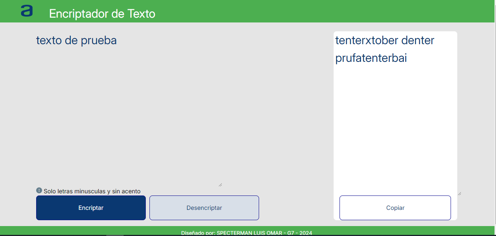
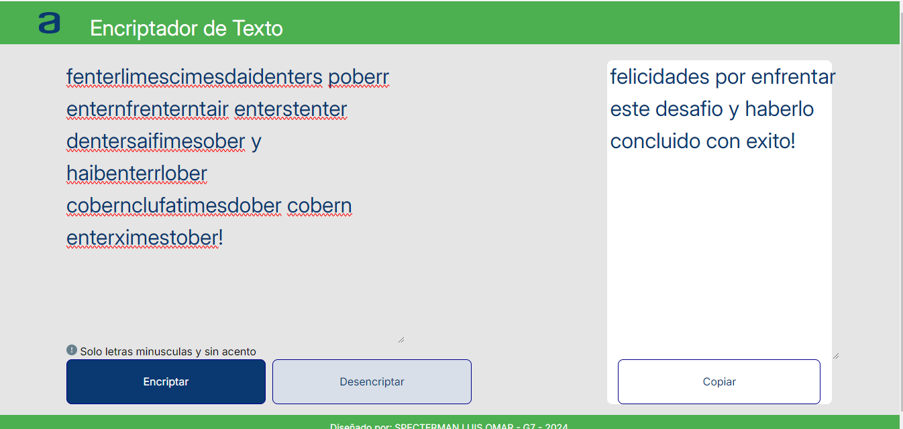

# Encriptador de Texto

## Descripción

Este proyecto es una aplicación web simple que encripta y desencripta texto usando un conjunto de reglas definidas. Está diseñado para ser una herramienta fácil de usar para manipular texto.

## Tecnologías

- HTML
- CSS
- JavaScript

## Pagina Inicio

3. Ubicar y abrir el archivo `index.html` en tu navegador para ver la aplicación en acción.

## Uso

 ### Para encriptar
1. Ingresar el texto a encriptar en el área de texto de entrada.
2. Hacer click en el botón "Encriptar" para transformar el texto.
3. El texto encriptado aparecerá en el área de texto de salida.
4. Utilizar el botón "Copiar" para copiar el texto encriptado al portapapeles.

 ### Para desencriptar
1. Ingresar el texto a desencriptar en el área de texto de entrada.
2. Hacer click en el botón "Desencriptar" para transformar el texto a su forma original.
3. El texto desencriptado aparecerá en el área de texto de salida.
4. Utiliza el botón "Copiar" para copiar el texto desencriptado al portapapeles.

## Capturas de Pantalla

#### Vista de la pantalla de como se ve la aplicación:

#### Vista de la pantalla aplicación en uso:

#### Vista de la resolucion del mensaje secreto:

## Licencia

Este proyecto es free y puede ser usado por quien lo considere útil.

## Contacto

Para más información, puedes contactar a:

- **Nombre:** Luis Omar Specterman
- **Correo:** lspecte@gmail.com
- **GitHub:** https://github.com/SpectermanLuis/
