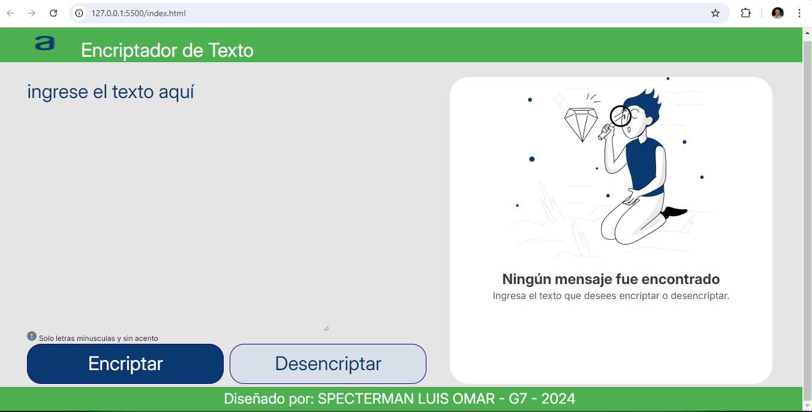
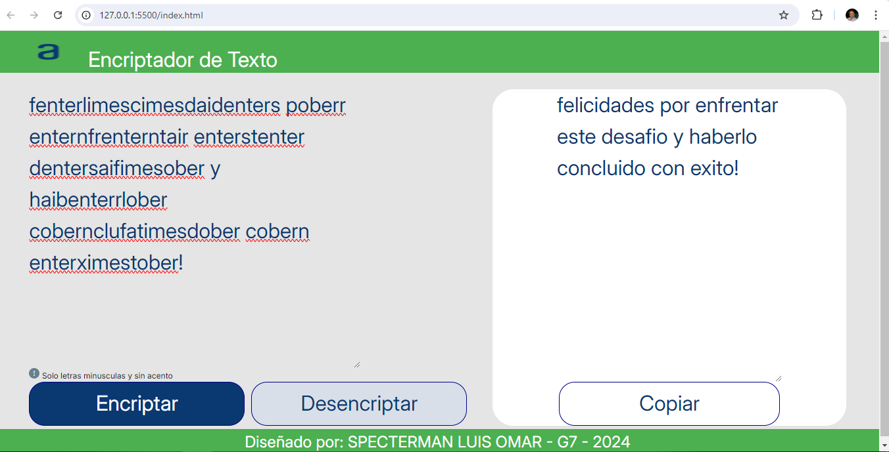

# Encriptador de Texto

## Descripción

Este proyecto es una aplicación web simple que encripta y desencripta texto usando un conjunto de reglas definidas. Está diseñado para ser una herramienta fácil de usar para manipular texto.

## Tecnologías

- HTML
- CSS
- JavaScript

## Instalación

1. Clona el repositorio:

    ```bash
    git clone https://github.com/tu-usuario/tu-repositorio.git
    ```

2. Navega al directorio del proyecto:

    ```bash
    cd tu-repositorio
    ```


3. Abre el archivo `index.html` en tu navegador para ver la aplicación en acción.

## Uso

1. Ingresa el texto en el área de texto de entrada.
2. Haz clic en el botón "Encriptar" para transformar el texto.
3. El texto encriptado aparecerá en el área de texto de salida.
4. Haz clic en el botón "Desencriptar" para revertir el texto a su forma original.
5. Utiliza el botón "Copiar" para copiar el texto encriptado al portapapeles.

## Capturas de Pantalla

Aquí puedes ver cómo se ve la aplicación:







## Contribuciones

Si deseas contribuir a este proyecto, por favor sigue estos pasos:

1. Haz un fork del repositorio.
2. Crea una nueva rama (`git checkout -b feature/nueva-caracteristica`).
3. Realiza tus cambios.
4. Haz commit de tus cambios (`git commit -am 'Agrega nueva característica'`).
5. Envía tu rama al repositorio (`git push origin feature/nueva-caracteristica`).
6. Crea un nuevo Pull Request.

## Licencia

Este proyecto está licenciado bajo la Licencia MIT - ver el archivo [LICENSE](LICENSE) para detalles.

## Contacto

Para más información, puedes contactar a:

- **Nombre:** Luis Omar
- **Correo:** tu-email@example.com
- **GitHub:** [tu-usuario](https://github.com/tu-usuario)
